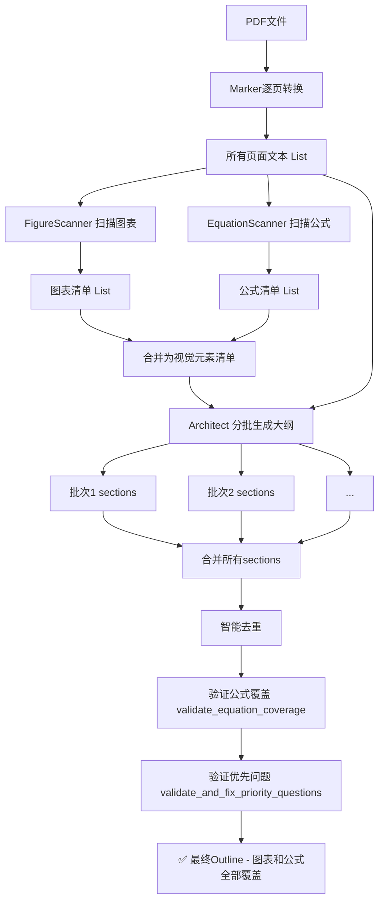

# 公式识别严格流程协议 (Formula Recognition Protocol)

## 概述

本文档定义了**公式识别、验证和分析**的严格流程，确保每个公式都能像图表一样拥有专门的子section分析。

## 问题陈述

当前系统存在的问题：
1. ✅ 图表有专门的扫描器 (`FigureScanner`) 预先识别
2. ✅ 图表有验证机制确保全部被分析
3. ❌ **公式没有独立的扫描器** - 完全依赖Architect从文本中"主动扫描"
4. ❌ **公式没有验证机制** - 无法确保所有公式都被识别和分析

## 目标

建立与图表完全对等的公式处理流程：

```
图表流程：FigureScanner → 图表清单 → Architect使用清单 → 验证覆盖
公式流程：EquationScanner → 公式清单 → Architect使用清单 → 验证覆盖  ⬅️ 新增
```

---

## 三层架构设计

### 第1层：公式扫描器 (EquationScanner)

#### 职责
在Marker处理完成后，从markdown文本中提取所有公式。

#### 输入
- Marker转换后的所有页面文本 (`List[str]`)

#### 输出
公式清单 `List[dict]`，每个条目包含：
```python
{
    "page": int,              # 0-indexed页码
    "equation_type": str,     # "numbered" | "unnumbered"
    "equation_number": str,   # 如 "1", "2", "1a" (编号公式) 或 None
    "equation_text": str,     # LaTeX公式文本 (去除$$符号)
    "context": str,           # 公式上下文 (前后各50字)
    "description": str        # 描述性标题 (根据上下文生成)
}
```

#### 识别规则

**A. 编号公式（优先级最高）**
- 模式1：独立编号 `(1)`, `(2)`, `(1a)` 等
  - 必须与 `$$...$$` 公式在±5行内
  - 提取编号作为 `equation_number`
  
- 模式2：显式引用 `Equation 1`, `Eq. 2`, `式(3)` 等
  - 在文本中搜索这些关键词
  - 向后查找最近的 `$$...$$` 公式（100字符内）
  
**B. 未编号显示公式（次优先）**
- 识别所有独立的 `$$...$$` 块
- 排除已匹配为编号公式的部分
- 根据上下文判断重要性：
  - **重要**：长度>20字符，包含关键符号（∑, ∫, ∂, max, argmax 等）
  - **次要**：简单赋值、已知定义
  
**C. 内嵌公式（不单独分析）**
- `$...$` 格式的内嵌公式不创建独立section
- 它们会在相关分析中被涉及

#### 上下文提取

为每个公式提取：
- **前文** (50字符): 识别关键词如 "where", "假设", "定义"
- **后文** (50字符): 识别解释性语句

#### 描述生成策略

基于上下文自动生成描述性标题：

| 上下文关键词 | 生成标题模板 | 示例 |
|------------|------------|------|
| "损失", "loss" | "{方法名}损失函数" | "交叉熵损失函数" |
| "更新", "update" | "{参数}更新规则" | "权重更新规则" |
| "贝叶斯", "posterior" | "{概念}计算公式" | "后验概率计算" |
| "定义", "definition" | "{符号}定义" | "学习率α定义" |
| "优化", "objective" | "优化目标函数" | "最小化目标函数" |
| 无明确关键词 | "第{section}部分公式" | "第3.2节核心公式" |

#### 分组策略

**自动分组规则**：
- **编号公式**: 连续编号(如Eq. 1-3)且主题相关 → 合并为一个section
- **未编号公式**: 1-3个在同一段落/主题下 → 可选合并
- **最大分组数**: 3个公式/组

---

### 第2层：Architect集成

#### 输入增强

在Architect的system prompt中增加公式清单：

```python
# 当前（仅图表）
figures_text = "已检测到的图表清单（必须全部分析）\n- Fig 1...\n- Table 2..."

# 新增（图表+公式）
visual_elements_text = """
## 已检测到的视觉元素清单（必须全部分析）

### 图表 (Figures & Tables)
- 第3页: Fig 1a-c: 实验范式
- 第5页: Table 1: 被试信息

### 公式 (Equations)
【编号公式】
- 第4页: Equation 1-3: logLR计算步骤
- 第6页: Equation 4: 贝叶斯更新

【重要的未编号公式】
- 第4页: 损失函数定义 ($$L = ...$$ 附近)
- 第7页: 后验概率计算

**强制要求**: 以上所有元素都必须在你的大纲中有对应section！
"""
```

#### Prompt调整

更新Architect的system prompt：

```diff
- ### ⚠️ 第一优先级：完整覆盖所有视觉元素
+ ### ⚠️ 第一优先级：完整覆盖所有视觉元素（图表+公式）

  **强制要求**：在设计任何问题之前，you must：
  1. **图表清单核查**：检查下方提供的图表清单...
+ 2. **公式清单核查**：检查下方提供的公式清单，每一个公式都必须有对应section
- 3. **公式全面扫描**：⚠️ 重要！你必须**主动扫描文本**寻找所有公式...
+ 3. **公式覆盖验证**：使用提供的公式清单，确保每个公式都有section
```

**关键改进**：
- 从"主动扫描"（不可靠）→"清单核查"（强制验证）
- Architect不再需要自己识别公式，只需根据清单创建section

---

### 第3层：验证与补全

#### 公式覆盖验证函数

类似于图表验证，新增：

```python
def validate_equation_coverage(
    outline: Outline, 
    equations_list: List[dict]
) -> Outline:
    """
    验证outline是否覆盖了所有检测到的公式
    如果缺失，自动补充
    """
    # 提取已有的公式section
    equation_sections = [s for s in outline.sections if s.type == 'equation']
    
    # 提取已分析的公式编号/描述
    analyzed_eqs = set()
    for section in equation_sections:
        # 从标题中提取公式标识
        eq_id = extract_equation_identifier(section.section_title)
        if eq_id:
            analyzed_eqs.add(eq_id)
    
    # 检测缺失的公式
    missing_eqs = []
    for eq in equations_list:
        eq_id = eq.get('equation_number') or eq.get('description')
        if eq_id and eq_id not in analyzed_eqs:
            missing_eqs.append(eq)
    
    # 自动补充缺失的公式section
    if missing_eqs:
        print(f"⚠️  检测到{len(missing_eqs)}个未分析的公式，自动补充...")
        for eq in missing_eqs:
            补充section = create_equation_section(eq)
            outline.sections.append(补充section)
            print(f"  🔧 补充: {补充section.section_title}")
    else:
        print(f"✅ 所有检测到的公式都有对应分析section")
    
    return outline
```

#### 优先问题验证（已存在）

`validate_and_fix_priority_questions()` 已经支持公式，确保每个equation section都有：
1. **问题1 (what)**: 数学表达式是什么？各符号代表什么？
2. **问题2 (principle)**: 推导逻辑和计算原理是什么？

---

## 完整工作流程



---

## 实施计划

### 阶段1：创建EquationScanner

**文件**: `analyze_paper.py`

**新增类** (参考FigureScanner):
```python
class EquationScanner:
    """扫描Marker输出中的所有公式"""
    
    def __init__(self, all_pages_text: List[str]):
        self.all_pages_text = all_pages_text
    
    def scan_all_equations(self) -> List[dict]:
        """
        扫描所有页面识别公式
        返回: [{"page": int, "equation_type": str, ...}, ...]
        """
        equations = []
        
        for page_num, page_text in enumerate(self.all_pages_text):
            # 1. 识别编号公式
            numbered_eqs = self._extract_numbered_equations(page_text, page_num)
            equations.extend(numbered_eqs)
            
            # 2. 识别重要的未编号显示公式
            unnumbered_eqs = self._extract_unnumbered_equations(
                page_text, page_num, numbered_eqs
            )
            equations.extend(unnumbered_eqs)
        
        return equations
    
    def _extract_numbered_equations(self, text: str, page_num: int) -> List[dict]:
        """提取编号公式"""
        # 实现编号识别逻辑
        ...
    
    def _extract_unnumbered_equations(
        self, text: str, page_num: int, 
        exclude_numbered: List[dict]
    ) -> List[dict]:
        """提取未编号但重要的显示公式"""
        # 实现未编号公式筛选逻辑
        ...
```

### 阶段2：集成到main流程

**位置**: `main()` 函数，第1269行附近

```python
# 当前代码
print("📊 图表扫描: 正在识别PDF中的所有图表...")
figure_scanner = FigureScanner(str(pdf_path))
figures_list = figure_scanner.scan_all_figures()
figure_scanner.close()
print(f"✅ 检测到 {len(figures_list)} 个图表/表格")

# 新增
print("🔢 公式扫描: 正在识别Marker输出中的所有公式...")
equation_scanner = EquationScanner(all_pages_text)
equations_list = equation_scanner.scan_all_equations()
print(f"✅ 检测到 {len(equations_list)} 个公式")
print(f"   - 编号公式: {sum(1 for eq in equations_list if eq['equation_type'] == 'numbered')}")
print(f"   - 重要未编号公式: {sum(1 for eq in equations_list if eq['equation_type'] == 'unnumbered')}")
```

### 阶段3：更新Architect prompt

**位置**: `ArchitectAgent.generate_outline()` 方法

```python
# 构建视觉元素清单文本（合并图表和公式）
visual_elements_text = ""

if figures_list:
    visual_elements_text += "\n\n## 已检测到的图表清单\n"
    for fig in figures_list:
        visual_elements_text += f"- 第{fig['page']+1}页: {fig['caption']}\n"

if equations_list:  # 新增
    visual_elements_text += "\n\n## 已检测到的公式清单\n"
    visual_elements_text += "### 编号公式\n"
    for eq in [e for e in equations_list if e['equation_type'] == 'numbered']:
        visual_elements_text += f"- 第{eq['page']+1}页: Equation {eq['equation_number']}: {eq['description']}\n"
    
    visual_elements_text += "\n### 重要的未编号公式\n"
    for eq in [e for e in equations_list if e['equation_type'] == 'unnumbered']:
        visual_elements_text += f"- 第{eq['page']+1}页: {eq['description']}\n"

if visual_elements_text:
    visual_elements_text += "\n**重要**: 以上所有图表和公式都必须在你的分析大纲中体现。\n"
```

### 阶段4：添加验证函数

**位置**: `main()` 函数，验证环节

```python
# 当前验证流程
unique_sections = deduplicate_sections(all_sections, figures_list)
temp_outline = Outline(...)

# 新增公式覆盖验证
temp_outline = validate_equation_coverage(temp_outline, equations_list)

# 现有优先问题验证（已支持公式）
outline = validate_and_fix_priority_questions(temp_outline, figures_list)
```

---

## 预期效果

### 控制台输出示例

```
📊 图表扫描: 正在识别PDF中的所有图表...
✅ 检测到 12 个图表/表格

🔢 公式扫描: 正在识别Marker输出中的所有公式...
✅ 检测到 18 个公式
   - 编号公式: 8
   - 重要未编号公式: 10

架构师: 正在分批生成深度阅读大纲...
📚 共23页，将分5批处理（每批5页）
...

🔧 去重完成: 移除了3个重复section，保留48个唯一section

📊 图表覆盖验证: 检测到12个图表，生成了12个图表分析section
✅ 所有检测到的图表都有对应分析section

🔢 公式覆盖验证: 检测到18个公式，生成了15个公式分析section
⚠️  检测到3个未分析的公式，自动补充...
  🔧 补充: 3.2.4 无偏估计量定义
  🔧 补充: 4.1.3 置信区间计算
  🔧 补充: 附录A.2 推导步骤2
✅ 公式覆盖验证完成

✅ 优先问题验证通过: 所有figure/equation section都包含'是什么'和'原理'两个优先问题
```

### Outline结构示例

```
3. 实验设计 (Methods)
├─ 3.1 实验范式与刺激
│  ├─ 3.1.1 Fig 1a-c: 任务范式三条件 ✅
│  └─ 3.1.2 Fig 2: 刺激材料示例 ✅
├─ 3.2 理论框架与公式
│  ├─ 3.2.1 Equation 1-3: logLR计算步骤 ✅
│  ├─ 3.2.2 贝叶斯更新公式 ✅ (未编号但重要)
│  ├─ 3.2.3 损失函数定义 ✅ (未编号但重要)
│  └─ 3.2.4 无偏估计量定义 🔧 (自动补充)
└─ 3.3 数据收集流程

4. 结果 (Results)
├─ 4.1 行为数据分析
│  ├─ 4.1.1 Fig 3a-d: 准确率分组对比 ✅
│  ├─ 4.1.2 Fig 4-5: 反应时与学习曲线 ✅
│  └─ 4.1.3 置信区间计算 🔧 (自动补充)
...
```

---

## 与图表分析的对等性

| 维度 | 图表分析 | 公式分析 | 状态 |
|-----|---------|---------|------|
| **预扫描** | FigureScanner | EquationScanner | 🚧 待实现 |
| **清单提供** | 传给Architect | 传给Architect | 🚧 待实现 |
| **覆盖验证** | validate图表覆盖 | validate_equation_coverage | 🚧 待实现 |
| **优先问题** | what + principle | what + principle | ✅ 已实现 |
| **自动补全** | 缺失图表补充section | 缺失公式补充section | 🚧 待实现 |
| **子section结构** | 3.1.1 Fig 1 | 3.2.1 Eq 1 | ✅ 已实现 |

---

## 总结

通过实施本协议，我们将实现：

1. ✅ **完整覆盖**: 所有公式（编号+未编号）都被识别和分析
2. ✅ **结构统一**: 公式与图表拥有相同的子section结构
3. ✅ **质量保证**: 每个公式section都有"是什么+原理"优先问题
4. ✅ **自动验证**: 三层验证机制确保不遗漏
5. ✅ **清晰输出**: 控制台明确显示公式检测和覆盖情况

**核心思想**：不依赖Architect的"主动扫描"，而是通过**独立扫描器**预先提取公式清单，然后**强制验证**覆盖情况，就像处理图表一样。
